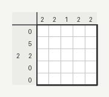

# Nonogram Dataset Generator (Demo)

A Python tool for generating **Nonogram (Picross) puzzle datasets** with PNG rendering and structured JSON metadata.

This repository is a **public demo version** that showcases the dataset structure and example outputs produced by the generator.

The full generation engine and extended dataset pipeline are kept in a private repository.

---

# Overview

This project generates Nonogram puzzles programmatically and exports them in two formats:

• **PNG images** showing the puzzle grid and clues  
• **JSON metadata** containing the full puzzle representation

The generated dataset can be used for:

- puzzle platforms
- algorithm testing
- dataset creation
- machine learning experiments
- puzzle solving research

---

# Example Puzzle

Example output generated by the system:



---

# Dataset Structure

Each puzzle includes a JSON file with structured metadata.

Example:

```json
{
  "id": "5x5_0001",
  "size": 5,
  "grid": [
    "01110",
    "11111",
    "01110",
    "01110",
    "00000"
  ],
  "row_clues": ["3", "5", "3", "3", "0"],
  "col_clues": ["1", "4", "4", "4", "1"],
  "filled_cells": 14,
  "empty_cells": 11,
  "density": 0.56,
  "image_file": "puzzle_0001.png"
}
